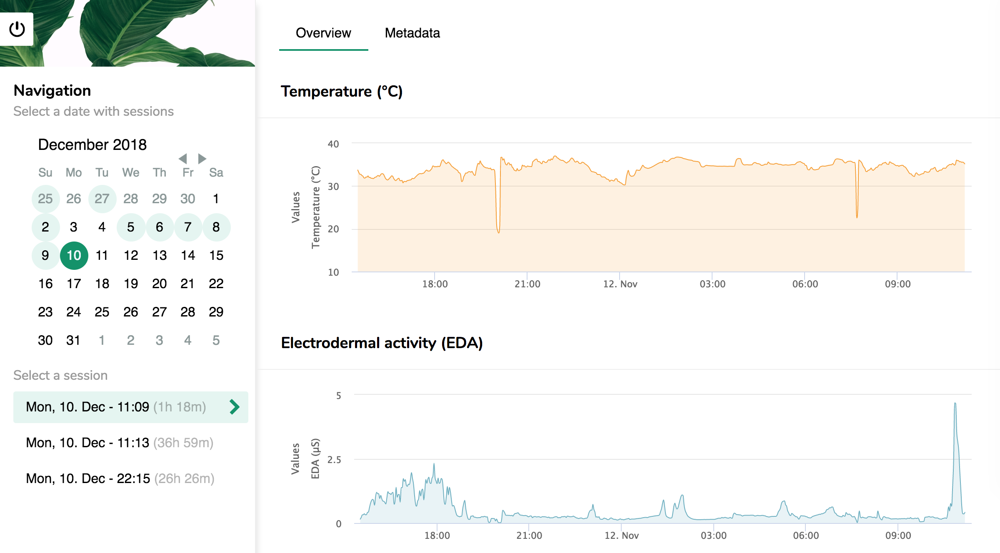
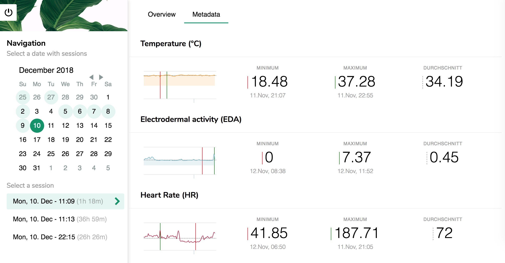

## Empatica Dashboard (Client)

> React clone of the empatica web application with extra functionality

#### Functionality

- [x] Authentication via [`emptica-api`](https://github.com/mrzmyr/empatica-api)
- [x] Independent Graphs for temperature, electrodermal activity, heart rate, blood volume pulse and acceleration
- [x] Session selector (single)
- [x] Meta data inspector

### Screenshots

**Login**


**Graphs**



**Metadata**



### Install

Install all node modules that are used by the application

```sh
npm install
```

### Usage

Start a **development** server on: [http://localhost:3000/](http://localhost:3000/)

```sh
npm run start
```

### Build

Create a *ready-to-deploy* build in the `/build` directory

```sh
npm run build
```
